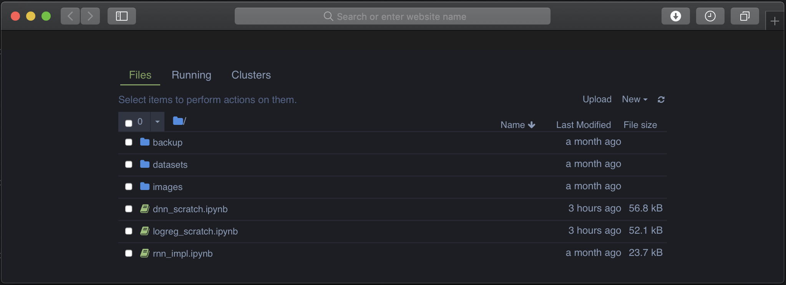
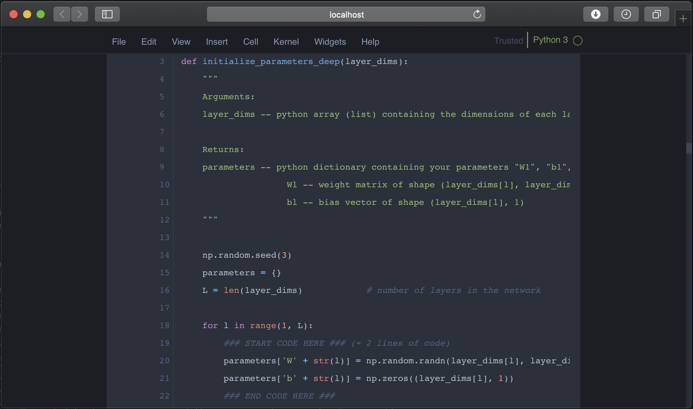
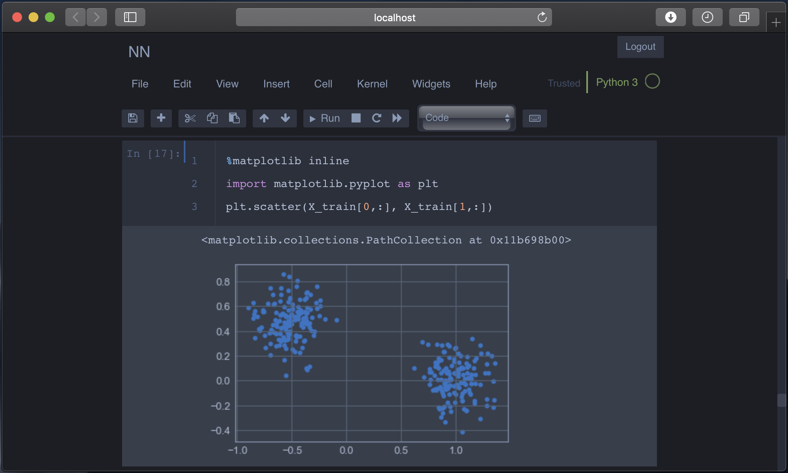
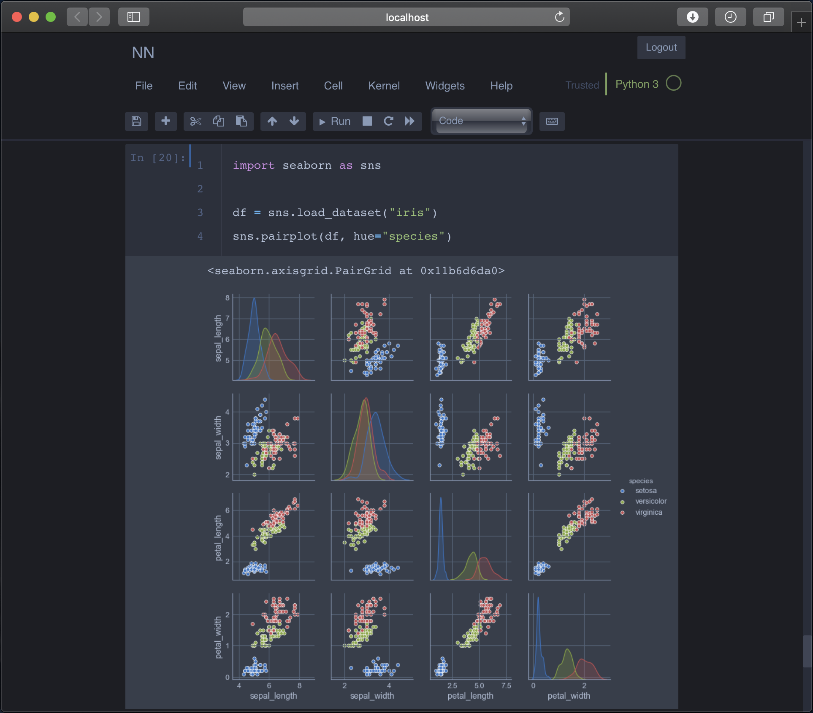

# Jupyter Notebook OneDark Theme

Already tested in chrome and safari

### Installation

```bash
git clone https://github.com/deryrahman/jupyter-notebook-one-dark-theme.git
cd jupyter-notebook-one-dark-theme
cp custom.css ~/.jupyter/custom/custom.css
pip install jupyterthemes
cp startup.py ~/.ipython/profile_default/startup/startup.py
```

### Screenshots





---
References:

[https://github.com/dunovank/jupyter-themes](https://github.com/dunovank/jupyter-themes)
